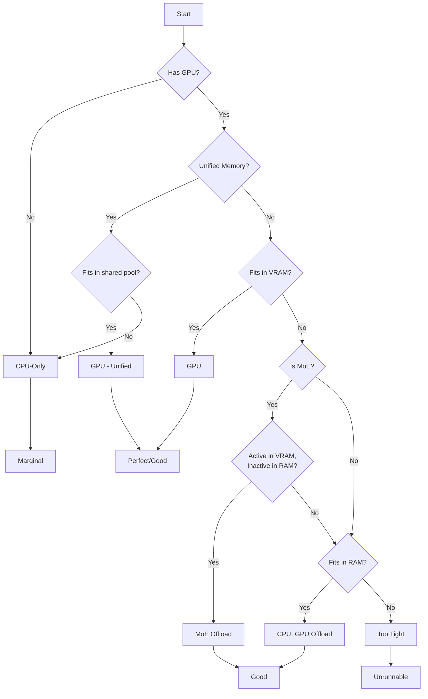

Fit analysis determines whether a model can run on your hardware and how efficiently it will use available memory. llmfit evaluates fit across four levels with dynamic quantization selection.

## Four Fit Levels

<CardGroup cols={2}>
<Card title="Perfect" icon="circle-check" color="#00ff00">
**Criteria:**
- Running on GPU (not CPU-only)
- Recommended memory met
- Comfortable headroom for inference

**Memory range:** ≤ recommended_ram_gb

**Only achievable with GPU acceleration.**
</Card>

<Card title="Good" icon="circle-dot" color="#ffff00">
**Criteria:**
- Fits with ≥20% headroom
- Best achievable for MoE offload
- Best achievable for CPU+GPU offload

**Memory range:** mem_required × 1.2 ≤ mem_available

**CPU-only cannot reach Good.**
</Card>

<Card title="Marginal" icon="circle-half-stroke" color="#ff9900">
**Criteria:**
- Minimum memory met but tight
- Best achievable for CPU-only
- Risk of OOM under load

**Memory range:** mem_required ≤ mem_available < mem_required × 1.2

**CPU-only always caps here.**
</Card>

<Card title="Too Tight" icon="circle-xmark" color="#ff0000">
**Criteria:**
- Insufficient memory in all pools
- Model will not run

**Memory range:** mem_required > mem_available

**Unrunnable—always ranks last.**
</Card>
</CardGroup>

## Fit Scoring Logic

Fit level depends on both **memory headroom** and **run mode**:

```rust
fn score_fit(
    mem_required: f64,
    mem_available: f64,
    recommended: f64,
    run_mode: RunMode,
) -> FitLevel {
    if mem_required > mem_available {
        return FitLevel::TooTight;  // Doesn't fit
    }

    match run_mode {
        RunMode::Gpu => {
            if recommended <= mem_available {
                FitLevel::Perfect  // Recommended memory met on GPU
            } else if mem_available >= mem_required * 1.2 {
                FitLevel::Good     // 20%+ headroom
            } else {
                FitLevel::Marginal // Tight fit
            }
        }
        RunMode::MoeOffload | RunMode::CpuOffload => {
            if mem_available >= mem_required * 1.2 {
                FitLevel::Good     // Caps at Good (no Perfect)
            } else {
                FitLevel::Marginal
            }
        }
        RunMode::CpuOnly => {
            FitLevel::Marginal     // Always caps at Marginal
        }
    }
}
```

<Note>
**Key insight:** CPU-only and offload modes can never achieve Perfect. Perfect requires GPU acceleration with comfortable memory.
</Note>

## Run Mode Determination

llmfit tries execution paths in order of preference:

<Steps>
<Step title="Check for GPU">
If `system.has_gpu == false`, skip to CPU-only path.
</Step>

<Step title="Unified Memory Detection">
If `system.unified_memory == true` (Apple Silicon, NVIDIA Grace):
- GPU and CPU share the same memory pool
- No separate CPU+GPU offload path
- Use GPU path with full memory budget
</Step>

<Step title="Try GPU Path (Discrete VRAM)">
Attempt to fit the model in VRAM with dynamic quantization:

```rust
if let Some((quant, mem)) = model.best_quant_for_budget(system_vram, ctx) {
    return (RunMode::Gpu, mem, system_vram);
}
```

If any quantization level fits, use GPU path.
</Step>

<Step title="Try MoE Offload (MoE Models Only)">
For Mixture-of-Experts models, try expert offloading:

```rust
for &quant in QUANT_HIERARCHY {
    let (moe_vram, offloaded_gb) = moe_memory_for_quant(model, quant)?;
    if moe_vram <= system_vram && offloaded_gb <= available_ram {
        return (RunMode::MoeOffload, moe_vram, system_vram);
    }
}
```

**Requirements:**
- Active experts fit in VRAM
- Inactive experts fit in system RAM
</Step>

<Step title="Try CPU+GPU Offload">
Model doesn't fit in VRAM—spill to system RAM:

```rust
if let Some((quant, mem)) = model.best_quant_for_budget(available_ram, ctx) {
    return (RunMode::CpuOffload, mem, available_ram);
}
```

**Penalty:** 0.5× GPU speed (RAM bandwidth bottleneck)
</Step>

<Step title="Fall Back to CPU-Only">
Last resort—run entirely in system RAM:

```rust
if let Some((quant, mem)) = model.best_quant_for_budget(available_ram, ctx) {
    return (RunMode::CpuOnly, mem, available_ram);
} else {
    return (RunMode::CpuOnly, default_mem, available_ram);  // TooTight
}
```

**Penalties:**
- 0.3× GPU speed
- Fit caps at Marginal
</Step>
</Steps>

## Dynamic Quantization Selection

Instead of using the model's default quantization, llmfit walks a hierarchy to find the **best quality that fits**:

### GGUF Quantization Hierarchy (llama.cpp)

```rust
const QUANT_HIERARCHY: &[&str] = &[
    "Q8_0",    // Best quality (1.05 bytes/param)
    "Q6_K",    // (0.80 bytes/param)
    "Q5_K_M",  // (0.68 bytes/param)
    "Q4_K_M",  // Standard (0.58 bytes/param)
    "Q3_K_M",  // (0.48 bytes/param)
    "Q2_K",    // Most compressed (0.37 bytes/param)
];
```

### MLX Quantization Hierarchy (Apple Silicon)

```rust
const MLX_QUANT_HIERARCHY: &[&str] = &[
    "mlx-8bit",  // Best quality (1.0 bytes/param)
    "mlx-4bit",  // Compressed (0.55 bytes/param)
];
```

### Selection Algorithm

```rust
fn best_quant_for_budget(
    &self,
    budget_gb: f64,
    ctx: u32,
    hierarchy: &[&'static str],
) -> Option<(&'static str, f64)> {
    // Try best quality first
    for &quant in hierarchy {
        let mem = self.estimate_memory_gb(quant, ctx);
        if mem <= budget_gb {
            return Some((quant, mem));
        }
    }
    
    // Try halving context once
    let half_ctx = ctx / 2;
    if half_ctx >= 1024 {
        for &quant in hierarchy {
            let mem = self.estimate_memory_gb(quant, half_ctx);
            if mem <= budget_gb {
                return Some((quant, mem));
            }
        }
    }
    
    None  // Nothing fits
}
```

<Info>
**Example:** Llama-3.1-70B on RTX 4090 (24 GB VRAM)

- Q8_0: 75.2 GB — doesn't fit
- Q6_K: 58.0 GB — doesn't fit
- Q5_K_M: 49.3 GB — doesn't fit
- **Q4_K_M: 42.2 GB — doesn't fit**
- Q3_K_M: 34.7 GB — doesn't fit
- Q2_K: 26.7 GB — doesn't fit

llmfit halves context (131K → 65K) and retries:

- Q8_0 @ 65K ctx: 73.1 GB — doesn't fit
- Q6_K @ 65K ctx: 55.9 GB — doesn't fit
- Q5_K_M @ 65K ctx: 47.2 GB — doesn't fit
- **Q4_K_M @ 65K ctx: 40.1 GB — doesn't fit**
- Q3_K_M @ 65K ctx: 32.6 GB — doesn't fit
- **Q2_K @ 65K ctx: 24.6 GB — fits!** ✓

Result: `Q2_K` at 65K context, 24.6 GB VRAM
</Info>

## Memory Estimation Formula

llmfit computes memory requirements dynamically:

```rust
fn estimate_memory_gb(&self, quant: &str, ctx: u32) -> f64 {
    let bpp = quant_bpp(quant);  // Bytes per parameter
    let params = self.params_b();
    
    // Model weights
    let model_mem = params * bpp;
    
    // KV cache: ~0.000008 GB per billion params per token
    let kv_cache = 0.000008 * params * ctx as f64;
    
    // Runtime overhead (CUDA context, buffers, etc.)
    let overhead = 0.5;
    
    model_mem + kv_cache + overhead
}
```

**Components:**

<AccordionGroup>
<Accordion title="Model Weights" icon="weight-hanging">
**Formula:** `params × bytes_per_param(quant)`

**Example:** 7B @ Q4_K_M = 7 × 0.58 = 4.06 GB

This is the bulk of memory usage—the model parameters themselves.
</Accordion>

<Accordion title="KV Cache" icon="database">
**Formula:** `0.000008 × params × context_length`

**Example:** 7B @ 8K context = 0.000008 × 7 × 8192 = 0.46 GB

Stores key/value tensors for attention mechanism. Grows linearly with context length.
</Accordion>

<Accordion title="Runtime Overhead" icon="gears">
**Fixed:** 0.5 GB

Covers CUDA/Metal context, buffer allocations, and framework overhead.
</Accordion>
</AccordionGroup>

<Warning>
These are **estimates**. Actual memory usage depends on the runtime (Ollama, llama.cpp, MLX), batch size, and inference settings.
</Warning>

## Memory Utilization Targets

llmfit aims for specific utilization ranges:

<Tabs>
  <Tab title="GPU Inference">
    **Target:** 50-80% of VRAM
    
    ```
    VRAM: 24 GB
    Ideal range: 12-19.2 GB
    
    ✓ 16 GB model: 67% utilization (Perfect)
    ✗ 6 GB model: 25% utilization (under-utilizing)
    ✗ 23 GB model: 96% utilization (too tight)
    ```
    
    **Sweet spot:** Efficient use without risking OOM.
  </Tab>
  
  <Tab title="CPU+GPU Offload">
    **Target:** ≥20% headroom in system RAM
    
    ```
    Available RAM: 32 GB
    Model: 25 GB
    Utilization: 78% (Good)
    
    Model: 30 GB
    Utilization: 94% (Marginal—risk of swapping)
    ```
    
    Offload scenarios need extra headroom to avoid OS-level memory pressure.
  </Tab>
  
  <Tab title="CPU-Only">
    **Target:** Minimize memory footprint
    
    ```
    Available RAM: 16 GB
    Best strategy: Lowest viable quantization (Q2_K)
    
    7B @ Q2_K: 2.59 GB (16% utilization)
    Fit level: Marginal (CPU-only caps here)
    ```
    
    CPU-only prioritizes fitting at all—efficiency is secondary.
  </Tab>
</Tabs>

## MoE Expert Offloading

Mixture-of-Experts models can split across VRAM and RAM:

### Memory Split Calculation

```rust
fn moe_memory_for_quant(model: &LlmModel, quant: &str) -> Option<(f64, f64)> {
    let active_params = model.active_parameters? as f64;
    let total_params = model.parameters_raw? as f64;
    let bpp = quant_bpp(quant);
    
    // Active experts → VRAM
    let active_vram = ((active_params * bpp) / GB) * 1.1;  // +10% overhead
    
    // Inactive experts → RAM
    let inactive_params = (total_params - active_params).max(0.0);
    let offloaded_ram = (inactive_params * bpp) / GB;
    
    Some((active_vram, offloaded_ram))
}
```

### Example: Mixtral 8x7B @ Q4_K_M

```
Total params: 46.7B
Active params (2/8 experts): 12.9B
Inactive params: 33.8B

Active VRAM = (12.9B × 0.58) / 1024³ × 1.1 = 8.0 GB
Offloaded RAM = (33.8B × 0.58) / 1024³ = 20.9 GB

Requirements:
- VRAM: 8.0 GB (vs 23.9 GB for full model)
- System RAM: 20.9 GB

✓ Fits on RTX 3090 (24 GB VRAM) + 32 GB system RAM
✗ Wouldn't fit as pure GPU (needs 23.9 GB VRAM)
```

<Success>
**Memory savings:** 15.9 GB VRAM (66% reduction) with only ~20% speed penalty from expert switching.
</Success>

## Fit Analysis Examples

<AccordionGroup>
<Accordion title="Example 1: Perfect Fit">
**Hardware:** RTX 4090 (24 GB VRAM), 64 GB RAM

**Model:** Qwen2.5-Coder-14B-Instruct

**Analysis:**
```
Default quantization: Q4_K_M
Estimated memory @ Q4_K_M, 32K ctx: 8.9 GB

Path selection:
1. Try GPU: 8.9 GB ≤ 24 GB VRAM ✓
   Selected quant: Q8_0 (best that fits)
   Memory @ Q8_0: 15.2 GB
   
Run mode: GPU
Fit level: Perfect (15.2 GB ≤ recommended 18.0 GB)
Utilization: 63% (sweet spot)
```

**Result:** Excellent fit—high-quality quantization with plenty of headroom.
</Accordion>

<Accordion title="Example 2: MoE Offload">
**Hardware:** RTX 3070 (8 GB VRAM), 32 GB RAM

**Model:** Mixtral 8x7B-Instruct

**Analysis:**
```
Total params: 46.7B
Active params: 12.9B

Path selection:
1. Try GPU: 23.9 GB > 8 GB VRAM ✗
2. Try MoE offload:
   - Q8_0: Active 13.8 GB > 8 GB VRAM ✗
   - Q6_K: Active 10.5 GB > 8 GB VRAM ✗
   - Q5_K_M: Active 8.9 GB > 8 GB VRAM ✗
   - Q4_K_M: Active 7.6 GB ≤ 8 GB VRAM ✓
     Inactive: 19.9 GB ≤ 32 GB RAM ✓

Run mode: MoeOffload
Fit level: Good (comfortable headroom in both pools)
VRAM utilization: 95%
RAM utilization: 62%
Speed: ~80% of full GPU
```

**Result:** Fits via expert offloading—wouldn't run otherwise.
</Accordion>

<Accordion title="Example 3: CPU+GPU Offload">
**Hardware:** GTX 1660 Ti (6 GB VRAM), 16 GB RAM

**Model:** Llama-3.1-8B-Instruct

**Analysis:**
```
Estimated @ Q4_K_M, 128K ctx: 8.2 GB

Path selection:
1. Try GPU: 8.2 GB > 6 GB VRAM ✗
2. Not MoE—skip expert offload
3. Try CPU offload:
   Available RAM: 12.8 GB (16 GB - OS usage)
   Q4_K_M: 8.2 GB ≤ 12.8 GB ✓

Run mode: CpuOffload
Fit level: Marginal (64% utilization but offload mode)
Speed: ~50% of GPU
```

**Result:** Spills to RAM—significant performance hit but runnable.
</Accordion>

<Accordion title="Example 4: Too Tight">
**Hardware:** GTX 1650 (4 GB VRAM), 8 GB RAM

**Model:** Llama-3.1-70B-Instruct

**Analysis:**
```
Estimated @ Q2_K (lowest quant), 4K ctx: 26.3 GB

Path selection:
1. Try GPU: 26.3 GB > 4 GB VRAM ✗
2. Not MoE—skip expert offload
3. Try CPU offload:
   Available RAM: 6.4 GB (8 GB - OS)
   Q2_K: 26.3 GB > 6.4 GB ✗
   
Run mode: GPU (reported against preferred path)
Fit level: TooTight
Notes:
- Insufficient VRAM and system RAM
- Need 26 GB VRAM or 35 GB system RAM
```

**Result:** Unrunnable. Model ranks last in fit results.
</Accordion>
</AccordionGroup>

## Context-Length Capping

Use `--max-context` to reduce memory requirements:

```bash
# Estimate fit at 4K context instead of model's max (128K)
llmfit --max-context 4096
```

**Effect on memory:**

```
Llama-3.1-8B @ Q4_K_M

Context: 128K
Memory: 4.06 GB (weights) + 7.37 GB (KV) + 0.5 GB = 11.93 GB

Context: 4K (capped)
Memory: 4.06 GB (weights) + 0.23 GB (KV) + 0.5 GB = 4.79 GB

Savings: 7.14 GB (60% reduction)
```

<Tip>
Context capping is most effective on long-context models (32K+). It has minimal impact on models with ≤8K context.
</Tip>

## Run Mode Selection Summary



<Check>
llmfit always tries the fastest path first (GPU) and falls back gracefully to slower modes when memory is insufficient.
</Check>
