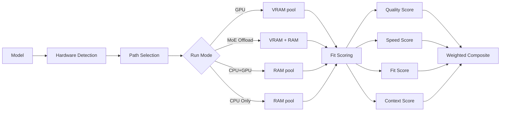

llmfit is a Rust-based CLI tool that right-sizes LLM models to your system hardware through a multi-stage process:

1. **Hardware detection**
2. **Model database loading**
3. **Dynamic quantization selection**
4. **Multi-dimensional scoring**
5. **Fit analysis and ranking**

## Architecture Overview

The codebase is organized into specialized modules:

```
llmfit-core/src/
├── hardware.rs    # System detection
├── models.rs      # Model database and quantization
├── fit.rs         # Scoring and ranking logic
└── providers.rs   # Runtime provider integration
```

<Note>
All data flows through these modules in sequence: hardware detection → model loading → fit analysis → scoring → ranking.
</Note>

## 1. Hardware Detection

The `SystemSpecs::detect()` function in `hardware.rs` probes your system using multiple detection methods:

### RAM and CPU

Uses the `sysinfo` crate to read:
- Total and available system RAM
- CPU core count and model name
- Available RAM with fallback strategies for platforms where `sysinfo` reports 0

```rust
let mut sys = System::new_all();
sys.refresh_all();
let total_ram_gb = sys.total_memory() as f64 / (1024.0 * 1024.0 * 1024.0);
let available_ram_gb = sys.available_memory() as f64 / (1024.0 * 1024.0 * 1024.0);
```

### Multi-GPU Detection

llmfit detects GPUs across all major vendors using vendor-specific tools and sysfs:

<AccordionGroup>
<Accordion title="NVIDIA GPUs">

**Primary method:** `nvidia-smi` with multi-GPU aggregation

```bash
nvidia-smi --query-gpu=memory.total,name --format=csv,noheader,nounits
```

Groups same-model GPUs and tracks per-card VRAM. For 2x RTX 3090, reports 24 GB per card (48 GB total VRAM for tensor splitting).

**Fallback:** Linux sysfs at `/sys/class/drm/card*/device/` for containerized environments where `nvidia-smi` is unavailable.

**Unified memory detection:** On NVIDIA Tegra and Grace Blackwell (GB10, GB20), detects unified CPU+GPU memory via `addressing_mode` field or model name heuristics.

</Accordion>

<Accordion title="AMD GPUs">

**Primary method:** `rocm-smi` for ROCm-enabled systems

```bash
rocm-smi --showmeminfo vram
rocm-smi --showproductname
```

**Fallback:** Linux sysfs vendor ID check (0x1002) at `/sys/class/drm/`

**APU support:** Detects AMD Ryzen AI unified memory APUs (Strix Halo, Strix Point) by CPU name pattern matching and assigns full system RAM as shared VRAM.

</Accordion>

<Accordion title="Intel Arc">

Uses sysfs to read discrete VRAM from `/sys/class/drm/card*/device/mem_info_vram_total` for Arc GPUs (A370M, A770).

Integrated Intel Arc GPUs detected via `lspci` with SYCL backend for oneAPI inference.

</Accordion>

<Accordion title="Apple Silicon">

Detects via `system_profiler SPDisplaysDataType`:

```bash
system_profiler SPDisplaysDataType | grep "Apple M"
```

On unified memory systems (M1/M2/M3/M4), VRAM = total system RAM since GPU and CPU share the same memory pool.

</Accordion>

<Accordion title="Ascend NPUs">

Detects Huawei Ascend NPUs via `npu-smi`:

```bash
npu-smi info -l                    # List NPU IDs
npu-smi info -t memory -i <id>     # Get HBM capacity
```

</Accordion>
</AccordionGroup>

### Backend Identification

llmfit automatically determines the inference acceleration backend:

| Backend | Hardware | Speed Constant |
|---------|----------|----------------|
| **CUDA** | NVIDIA GPUs | 220 |
| **Metal** | Apple Silicon | 160 (llama.cpp) / 250 (MLX) |
| **ROCm** | AMD GPUs with ROCm | 180 |
| **Vulkan** | AMD GPUs without ROCm, Windows AMD | 150 |
| **SYCL** | Intel Arc / oneAPI | 100 |
| **CPU (ARM)** | ARM processors | 90 |
| **CPU (x86)** | Intel/AMD CPUs | 70 |
| **NPU (Ascend)** | Huawei Ascend NPUs | 390 |

<Note>
On Apple Silicon with unified memory, llmfit prefers the **MLX** runtime for native optimization. Otherwise it defaults to **llama.cpp**.
</Note>

## 2. Model Database Loading

The `ModelDatabase::new()` function in `models.rs` loads the model list from `data/hf_models.json`, which is embedded at compile time via `include_str!()`:

```rust
const HF_MODELS_JSON: &str = include_str!("../data/hf_models.json");

let entries: Vec<HfModelEntry> = serde_json::from_str(HF_MODELS_JSON)
    .expect("Failed to parse embedded hf_models.json");
```

<Info>
**No runtime file I/O.** The database is baked into the binary, so llmfit works offline and has no dependency on external data files.
</Info>

## 3. Scoring and Ranking Flow

For each model, `ModelFit::analyze()` in `fit.rs` evaluates fitness across four dimensions:



### Path Selection Logic

1. **If GPU available:**
   - Try full GPU fit with dynamic quantization
   - For MoE models: try expert offloading (active experts in VRAM, inactive in RAM)
   - Fall back to CPU+GPU offload if VRAM insufficient
   - Last resort: CPU-only

2. **If unified memory (Apple Silicon, NVIDIA Grace):**
   - GPU and CPU share same pool → no separate CPU+GPU path
   - MoE models still noted but don't need offloading

3. **If no GPU:**
   - CPU-only path with dynamic quantization in system RAM

<CodeGroup>
```rust GPU Path
if let Some(system_vram) = system.total_gpu_vram_gb {
    if let Some((quant, mem)) = model.best_quant_for_budget(system_vram, ctx) {
        return (RunMode::Gpu, mem, system_vram);
    }
}
```

```rust MoE Offload Path
if model.is_moe {
    for &quant in QUANT_HIERARCHY {
        if let Some((moe_vram, offloaded_gb)) = moe_memory_for_quant(model, quant)
            && moe_vram <= system_vram
            && offloaded_gb <= system.available_ram_gb
        {
            return (RunMode::MoeOffload, moe_vram, system_vram);
        }
    }
}
```

```rust CPU Offload Path
if let Some((quant, mem)) = model.best_quant_for_budget(system.available_ram_gb, ctx) {
    return (RunMode::CpuOffload, mem, system.available_ram_gb);
}
```
</CodeGroup>

## 4. Run Modes

Each model is assigned one of four run modes based on hardware fit:

<CardGroup cols={2}>
<Card title="GPU" icon="rocket">
**Optimal performance**

Model fits entirely in VRAM. Fast inference with full GPU acceleration.

**Requirements:** VRAM ≥ model size at selected quantization
</Card>

<Card title="MoE Offload" icon="arrows-split-up-and-left">
**MoE optimization**

Active experts in VRAM, inactive experts offloaded to RAM. ~80% of GPU speed with reduced VRAM requirements.

**Example:** Mixtral 8x7B needs ~6.6 GB VRAM (active) + ~20 GB RAM (inactive) instead of 23.9 GB VRAM
</Card>

<Card title="CPU+GPU" icon="server">
**Mixed performance**

Model doesn't fit in VRAM, spills to system RAM with partial GPU offload. Significantly slower than pure GPU.

**Speed penalty:** 0.5× GPU baseline
</Card>

<Card title="CPU Only" icon="microchip">
**Fallback mode**

No GPU or insufficient VRAM. Model runs entirely in system RAM.

**Speed penalty:** 0.3× GPU baseline
**Fit cap:** Always Marginal (never Perfect/Good)
</Card>
</CardGroup>

## 5. Multi-Dimensional Scoring

Each model receives a composite score (0-100) weighted by use case:

| Use Case | Quality | Speed | Fit | Context |
|----------|---------|-------|-----|----------|
| **General** | 45% | 30% | 15% | 10% |
| **Coding** | 50% | 20% | 15% | 15% |
| **Reasoning** | 55% | 15% | 15% | 15% |
| **Chat** | 40% | 35% | 15% | 10% |
| **Multimodal** | 50% | 20% | 15% | 15% |
| **Embedding** | 30% | 40% | 20% | 10% |

<Tip>
Chat use cases prioritize **speed** (35%) while reasoning prioritizes **quality** (55%). The scoring adapts to what matters most for each workload.
</Tip>

## Performance Estimation

llmfit uses physics-based speed estimation when the GPU model is recognized:

```rust
// Token generation is memory-bandwidth-bound
let bandwidth_gbps = gpu_memory_bandwidth_gbps(gpu_name)?;
let model_gb = params * bytes_per_param(quant);
let raw_tps = (bandwidth_gbps / model_gb) * 0.55;  // 55% efficiency
```

**Validated against real benchmarks:**
- RTX 4090 (1008 GB/s): 7B Q4 → ~61 tok/s (measured: ~60 tok/s)
- T4 (320 GB/s): 7B F16 → ~16 tok/s (llama.cpp Discussion #4225)
- M1 Max (400 GB/s): 7B Q4 → ~61 tok/s (llama.cpp Discussion #4167)

For unrecognized GPUs, falls back to per-backend speed constants.

<Check>
llmfit's database contains bandwidth specs for ~80 GPUs across NVIDIA (consumer + datacenter), AMD (RDNA + CDNA), and Apple Silicon families.
</Check>
